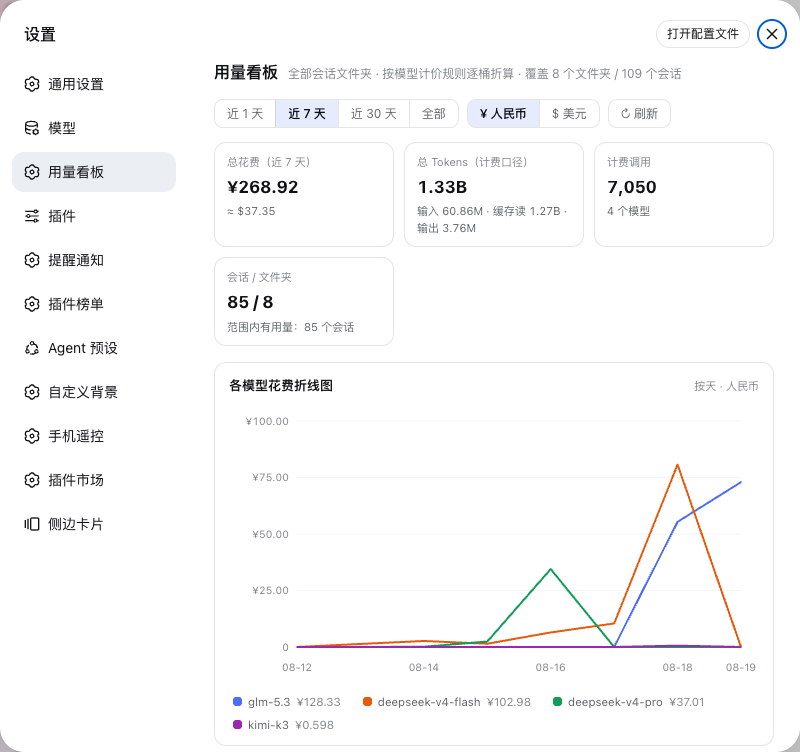

# dsh-usage-board

DSH（DeepSeek Harness）全局 **Token 用量与费用看板**：扫描 `~/.dsh/sessions` 下**所有文件夹**的全部会话日志，把每一条模型 usage 按它自己的**官方计价规则**（模型 × 涨价时代 × 峰谷时段）逐桶折算成金额，做成集成在**设置面板**里的看板，支持 **近 1 天 / 近 7 天 / 近 30 天 / 全部时间**筛选与**各模型花费折线图**。



## 为什么不是"粗略估算"

费用必须拆到具体模型的计价规则上，本插件逐条落实：

1. **按模型拆分**：每个模型的 usage 各自计价，绝不混用一口价。
2. **按时代拆分**：DeepSeek V4 系列 2026-08-17 0 点（北京时间）涨价，涨价前的记录用旧统一价，之后的用新价。
3. **按峰谷拆分**：新价区分高峰（北京时间 9-12 点、14-18 点）与空闲，逐小时桶判定。
4. **按币种拆分**：Kimi K3 官方刊例为美元，DeepSeek / GLM 为人民币；各自原生计价后按可配置汇率折算展示。
5. **计费口径与 provider 一致**：`inputTokens` 为未缓存输入（adapter 已把缓存命中拆出），缓存读取单独按缓存价计费；缓存写入无独立刊例，按未缓存输入价计费（与官方账单口径一致）。

### 内置计价目录（截至 2026-08，均可覆盖）

| 模型 | 时代 | 单价（每百万 tokens） | 来源 |
| --- | --- | --- | --- |
| DeepSeek V4 Flash | 涨价前 | 输入 ¥1.0 · 缓存命中 ¥0.02 · 输出 ¥2.0 | DeepSeek 官方公告（2026-08-17 前） |
| DeepSeek V4 Flash | 空闲时段 | 输入 ¥1.5 · 缓存命中 ¥0.05 · 输出 ¥4.5 | DeepSeek 官方公告（2026-08-17 起） |
| DeepSeek V4 Flash | 高峰时段 | 输入 ¥3.0 · 缓存命中 ¥0.10 · 输出 ¥9.0 | 同上（9-12 / 14-18 点） |
| DeepSeek V4 Pro | 涨价前 | 输入 ¥3.0 · 缓存命中 ¥0.025 · 输出 ¥6.0 | DeepSeek 官方公告（2026-08-17 前） |
| DeepSeek V4 Pro | 空闲时段 | 输入 ¥4.5 · 缓存命中 ¥0.15 · 输出 ¥13.5 | DeepSeek 官方公告（2026-08-17 起） |
| DeepSeek V4 Pro | 高峰时段 | 输入 ¥9.0 · 缓存命中 ¥0.30 · 输出 ¥27.0 | 同上（9-12 / 14-18 点） |
| Kimi K3 | 不分时 | 输入 $3.0 · 缓存命中 $0.30 · 输出 $15.0 | Moonshot AI 官方刊例 |
| GLM-5.3 | 不分时（**估算**） | 输入 ¥8 · 缓存命中 ¥2 · 输出 ¥28 | 按同基座 GLM-5.2 的 bigmodel.cn 刊例估算（GLM-5.3 官方 API 刊例未公布，看板明确标注，可在 config 覆盖） |

模型 id 带日期后缀（如 `deepseek-v4-pro-0813`）自动按前缀归入对应规则；完全没有规则的模型 token 照常统计、费用按 0 计并在看板提示补充单价——**绝不套用别的模型的价格冒充精确**。

## 看板功能

- **时间筛选**：近 1 天（按小时）/ 近 7 天 / 近 30 天 / 全部（按天）
- **汇总卡片**：总花费（¥/$ 双币）、总 Tokens（输入 / 缓存读 / 输出拆分）、计费调用数、会话与文件夹数
- **折线图**：各模型花费随时间变化，多序列 + 图例开关（点击显隐）+ 悬停查看当桶各模型花费
- **按模型明细**：token 四象拆分、双币费用、**可展开的计价规则**（每条规则的单价、生效时间、来源、命中次数、是否估算）
- **按文件夹明细**：`~/.dsh/sessions` 下每个工作目录文件夹的会话数、用量与费用
- **币种切换**：¥ / $，折算汇率可配置（默认 7.2）

## 安装

### 方式一：dsh-super-injector（免重启）

```bash
git clone https://github.com/nanami-0713/dsh-usage-board.git
cd dsh-usage-board
npm install && npm run build:all
# 用 super-injector 注入运行中的 DSH（host + client 立即生效）
```

### 方式二：bundle patch

把构建产物（`npm pack` 的 tgz）安装进 profile 的 `node_modules`，并在 profile 的 `cordis.patch.yml` 追加：

```yaml
- insert:
    - id: dsh-usage-board
      name: '@dsh-external/dsh-usage-board'
```

重启后由 `dsh.bundle.patch`（`cordis.patch.yml`）装配。

## 配置与 API

配置文件 `~/.dsh/plugins/dsh-usage-board/config.json`（看板首页文案已内置路径提示）：

```json
{
  "version": 1,
  "rateUsdCny": 7.2,
  "models": {
    "glm-5.3": {
      "currency": "CNY",
      "inputPerMillion": 8,
      "cacheReadPerMillion": 2,
      "outputPerMillion": 28,
      "source": "官方公布后覆盖",
      "estimated": false
    }
  }
}
```

同源 HTTP API（host 侧注册，浏览器经 DSH 同源访问）：

| 端点 | 说明 |
| --- | --- |
| `GET /api/dsh-usage-board/summary?range=1d\|7d\|30d\|all[&refresh=1]` | 看板数据（模型 / 文件夹 / 折线序列 / 命中的计价规则 / 提示） |
| `GET /api/dsh-usage-board/pricing` | 内置 + 覆盖后的计价目录 |
| `GET/PUT /api/dsh-usage-board/config` | 读取 / 覆盖汇率与模型单价 |

## 数据来源与精度

- 逐文件读取 `~/.dsh/sessions/<folder>/<session>/session.jsonl.zstd`（**多帧 zstd** 容器：扫描帧结构逐帧解码，与 DSH 持久化实现一致；并发写入中的撕裂尾帧跳过、下次扫描补齐）。
- usage 采样与 `dsh-token-meter` 的 last-wins 语义一致：同一 `(turn, step)` 的流式 usage chunk 与最终 assistant message **只计最终值，不双计**；只有 chunk（请求中断）的采样照样计费。
- 模型归属：usage 记录归属其前面最近的 `request/header.config.model/provider`。
- 增量索引：按 mtime+size 指纹复用缓存（`~/.dsh/plugins/dsh-usage-board/cache.json`），日常查询只重扫有变化的会话。
- 全程本地计算，不上传任何数据；不读取 API key。

### 已知口径说明

- 走 **Coding Plan 订阅**的 provider（GLM / Kimi Coding Plan）实际按订阅扣量，看板金额是"按量刊例价折算"，看板会明确标注，仅供参考。
- GLM-5.3 官方 API 刊例未公布，默认按同基座 GLM-5.2 刊例估算并标注"估算"；官方公布后建议在 config 覆盖。
- 折线图 / 汇总基于逐小时桶；一小时桶内峰谷一致（北京时间整点对齐，官方高峰窗口本身就是整点边界）。

## 开发与测试

```bash
npm install
npm test          # 22 项单元测试：计价规则 / 索引去重 / 多帧 zstd / 汇总构建
npm run typecheck # host + client 类型检查
npm run build:all # lib/index.js (host ESM) + lib/client.js (web bundle)
```

测试覆盖的关键口径：涨价时代分界（含边界时刻）、峰谷小时判定、多币种费用公式、用户覆盖优先级、chunk/message 去重、中断请求计费、多帧 zstd 解码（含撕裂尾帧）、时间范围过滤与序列补零、未计价模型告警。

## License

MIT
